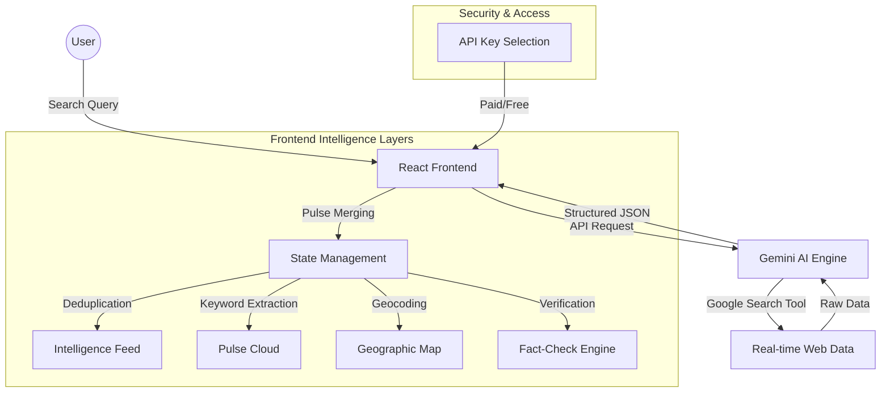

# PulsePortal Architecture

PulsePortal is a sophisticated real-time intelligence monitoring application built with a modern, reactive stack.

## 🏗️ High-Level Architecture

## 🛠️ Component Breakdown

### 1. Frontend Layer (React 18)
- **State Management**: Uses React hooks (`useState`, `useCallback`, `useEffect`) to manage the search state, results, and live update intervals.
- **Incremental Updates**: Implements "Pulse Merging" to deduplicate incoming data and highlight new items with "NEW" badges.
- **Animations**: Powered by `motion` for smooth layout transitions, entry animations, and interactive hover states.
- **Styling**: A custom Tailwind CSS configuration using a "Glassmorphism" aesthetic (zinc-950 background, semi-transparent borders, and emerald-500 accents).

### 2. Intelligence Layer (Gemini AI)
- **Model**: `gemini-3-flash-preview` for low-latency, high-intelligence processing.
- **Tools**: Utilizes the `googleSearch` tool to fetch real-time data from across the web.
- **Structured Output**: Enforces a strict JSON schema for news items, locations, keywords, and fact-check analysis.
- **Fact-Check Engine**: Performs automated verification of every report, assigning a status (Verified, Unverified, Disputed, Developing) and a reliability score.

### 3. Data Visualization
- **Live Map**: A custom SVG-based interactive map that geocodes news items and visualizes their global impact.
- **Pulse Cloud**: A dynamic word cloud that extracts and aggregates keywords, providing direct navigation to source articles.
- **Live Ticker**: A draggable, floating interface component that provides a continuous stream of updates.

### 4. Security & Access
- **API Key Selection**: Integrates with the `window.aistudio` API to allow users to select their own paid API keys for high-quota access.
- **Free Access Mode**: Provides a fallback for users without a custom key, ensuring the portal is accessible to everyone.

## 📊 Data Flow

1.  **Search**: User enters a query (e.g., "Global Tech Trends").
2.  **Fetch**: Frontend calls the Gemini service, passing the query and current local time.
3.  **Process**: Gemini searches the web, analyzes the results, performs fact-checking, and extracts keywords.
4.  **Merge**: Frontend receives the JSON response, deduplicates it against existing results, and marks new items.
5.  **Render**: The UI updates the Map, Pulse Cloud, and Intelligence Feed simultaneously with smooth animations.
6.  **Pulse**: A 60-second interval automatically triggers a new fetch to keep the intelligence fresh.
