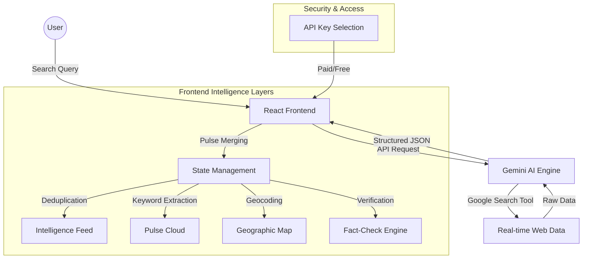

# PulsePortal: Real-Time Intelligence Network

PulsePortal is a high-performance, real-time intelligence monitoring station that pulses the globe for breaking news, social media trends, and geographic impact. Powered by Gemini AI, it provides an interactive dashboard for tracking events as they happen.

## 🚀 Core Features

- **Live Intelligence Feed**: Real-time news and social media updates with incremental "Pulse Merging" to ensure you only see the freshest data.
- **Geographic Impact Map**: Interactive global map visualizing the physical locations of breaking stories.
- **Pulse Cloud (Word Cloud)**: Dynamic keyword extraction that highlights trending topics and provides direct links to sources.
- **AI Fact-Check Intelligence**: Automated verification of every report with reliability scores and reasoning to combat misinformation.
- **Floating Intelligence Bar**: A draggable, real-time ticker that keeps you updated on the pulse of the world from any position on the screen.
- **Secure API Access**: Support for both high-quota paid API keys and limited free access modes.

## 🏗️ Architecture

## 🛠️ Tech Stack

- **Framework**: React 18 (Vite)
- **Styling**: Tailwind CSS (Glassmorphism Aesthetic)
- **Animations**: Motion (formerly Framer Motion)
- **Icons**: Lucide React
- **AI Engine**: Gemini 3 Flash Preview (`gemini-3-flash-preview`)
- **Mapping**: Custom SVG-based Interactive Geographic Layer

## 📸 Interface Overview

The PulsePortal interface is designed with a "Mission Control" aesthetic:

1.  **Header**: Real-time search and last-update timestamp.
2.  **Live Ticker**: A floating, draggable bar at the bottom for continuous updates.
3.  **Map View**: Compact geographic visualization of current events.
4.  **Pulse Cloud**: Interactive word cloud for trending keyword navigation.
5.  **Intelligence Feed**: Detailed news cards with "NEW" badges and Fact-Check status indicators.

## 🔑 Setup & Access

PulsePortal requires a Gemini API key to function. You can:
1.  **Connect a Paid API Key**: Recommended for high-quota, professional monitoring.
2.  **Continue with Free Access**: Uses default environment limits for casual exploration.

---
*Built with precision and intelligence for the modern information age.*
